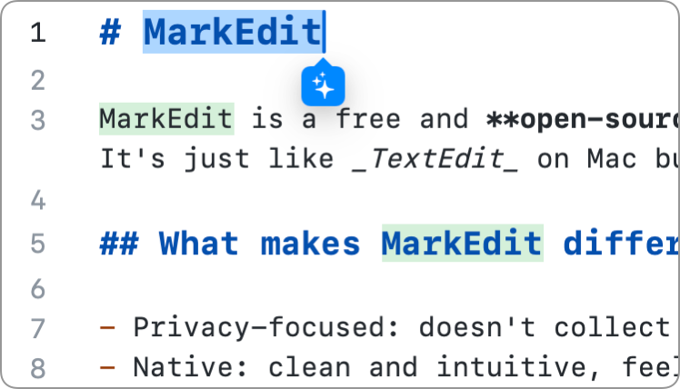
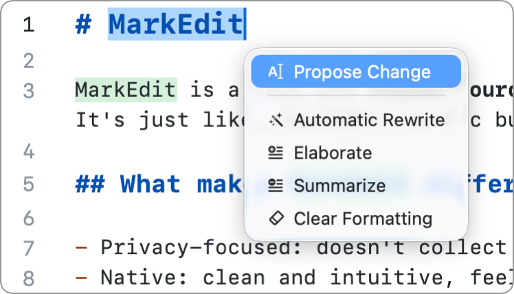

# MarkEdit-ai-writer

AI writer for MarkEdit that leverages [markedit-api](https://github.com/MarkEdit-app/MarkEdit-api), based on Apple's [Foundation Models](https://developer.apple.com/documentation/FoundationModels).

 

You can invoke it from the menu bar, with the keyboard shortcut <kbd>Option–Command–/</kbd>, or via the tooltip.

## Installation

Copy [dist/markedit-ai-writer.js](dist/markedit-ai-writer.js?raw=true) to `~/Library/Containers/app.cyan.markedit/Data/Documents/scripts/`.

You can also run `yarn install && yarn build` to build and deploy the script.

## Settings

In [settings.json](https://github.com/MarkEdit-app/MarkEdit/wiki/Customization#advanced-settings), you can define a settings node named `extension.markeditAIWriter` to configure this extension, default settings are:

```json
{
  "extension.markeditAIWriter": {
    "keyboardShortcut": "Mod-Alt-/",
    "showsTooltip": true,
    "streaming": false,
    "instructions": "You are a writing assistant specialized in rewriting text. Always return only the rewritten or improved version of the input while strictly preserving any Markdown formatting (including headings, lists, links, and inline styles). Do not add explanations, instructions, or commentary—output only the content itself.",
    "generationOptions": {},
    "customWriters": []
  }
}
```

- `keyboardShortcut`: The keyboard shortcut, see specs [here](https://codemirror.net/docs/ref/#view.KeyBinding).
- `showsTooltip`: Whether to show a tooltip as an entry point.
- `streaming`: Whether to enable output streaming.
- `instructions`: Instructions used to create the language model session.
- `generationOptions`: Generation options to control the output, in `{ temperature?: number; maximumResponseTokens?: number }` format.
- `customWriters`: Pre-defined prompts, see [writers.ts](src/writers.ts) for examples.

> This extension requires MarkEdit 1.27.0 or later and is supported only on macOS Tahoe with Apple Intelligence enabled.
